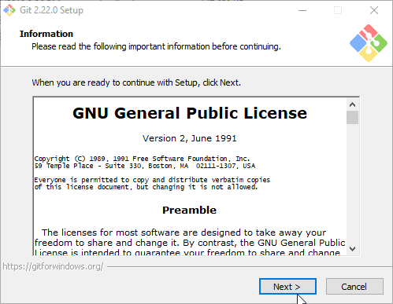
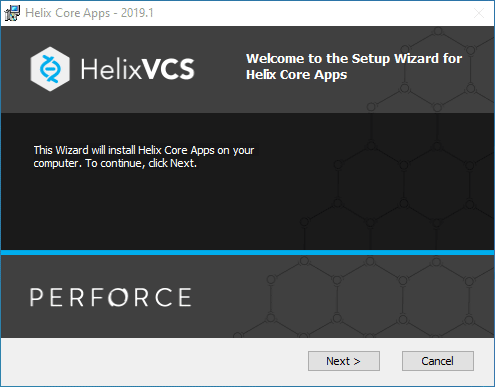

# Git init - Install Environemnt Manual

Scaricare i seguenti tool dai siti ufficiali:

|tool|download link|
|---------|----|
| git| [download](https://git-scm.com/download/win) |
| gitextensions| [download](https://github.com/gitextensions/gitextensions/releases/latest) |
| p4merge| [download](https://cdist2.perforce.com/perforce/r19.1/bin.ntx64/p4vinst64.exe) |
| fork *| [download](https://git-fork.com/update/win/ForkInstaller.exe) |

> \* fork è un programma alternativo a gitextensions, per alcune cose abbastanza carino e multipiattaforma.

## Installazione

Gitextensions e Fork non hanno bisogno di impostazioni particolari in fase di installazione e si può lasciare il deafult.

Per git e p4merge qui sotto un breve video vi indicherà il default ottimo da speficificare in fase di installazione 

### Git



### P4Merge



Per lanciare da command line il seutpkit già configurato:

```
p4vinst64 /v"ADDLOCAL=ALL REMOVE=P4ADMIN,P4V"
```
<!-- Reference: https://community.perforce.com/s/article/2456 -->

## Configurazione

Per configurare correttamente git digitare il seguente comando su una shell PowerShell

``` powershell
iex (new-object net.webclient).downloadstring('https://raw.githubusercontent.com/webartoli/git-init/master/install-environment/config/apply.ps1')
```